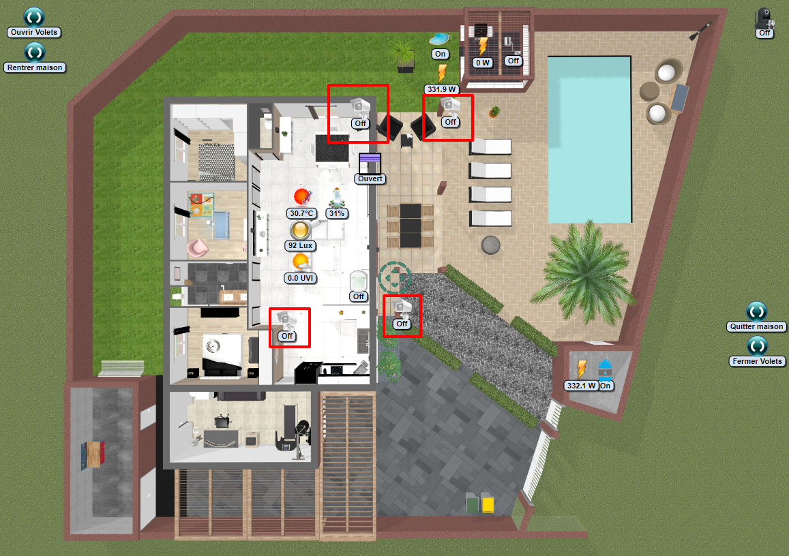
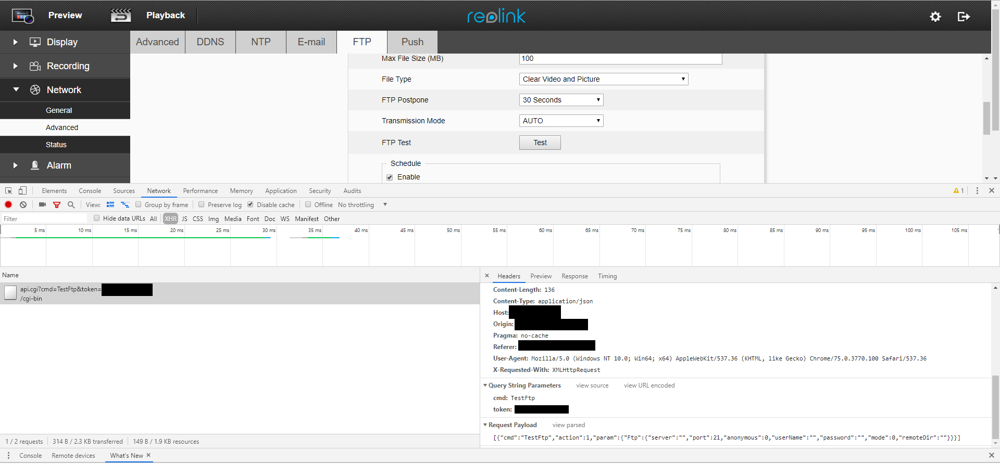
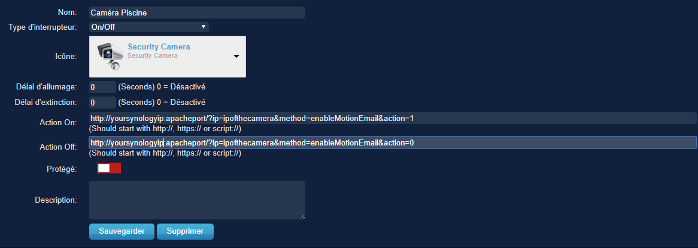
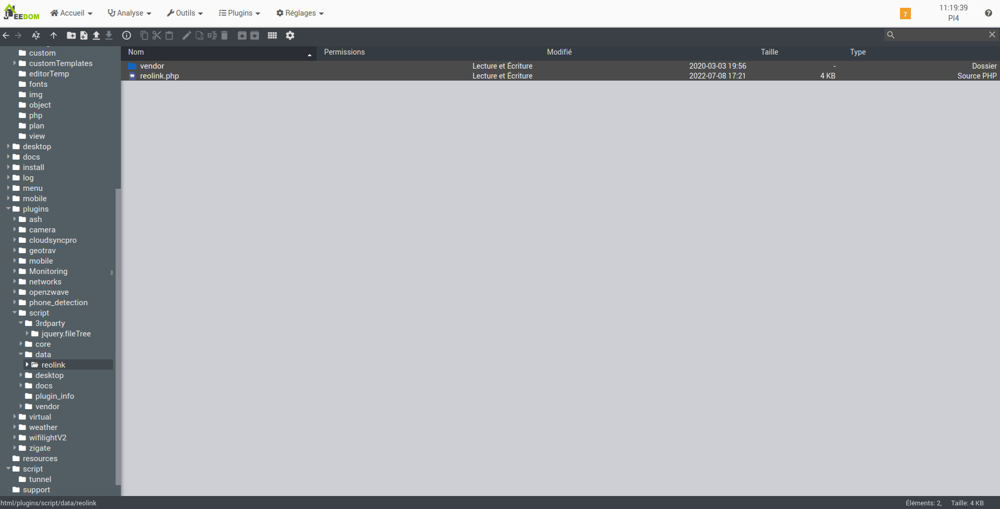
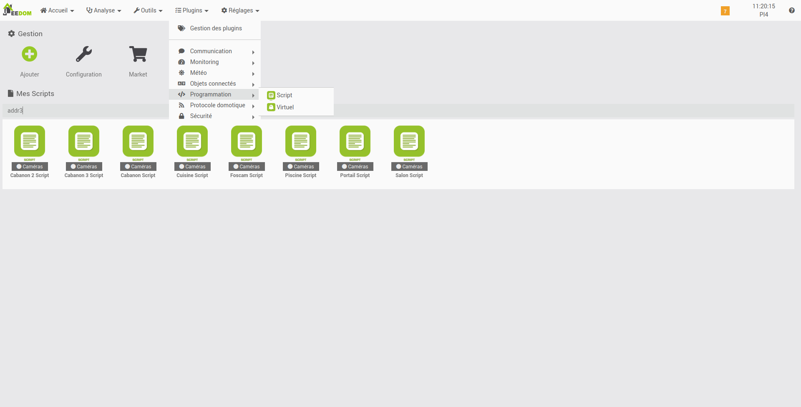
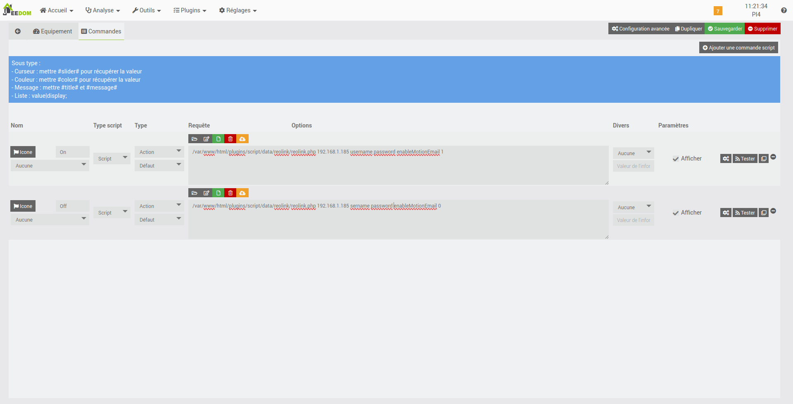
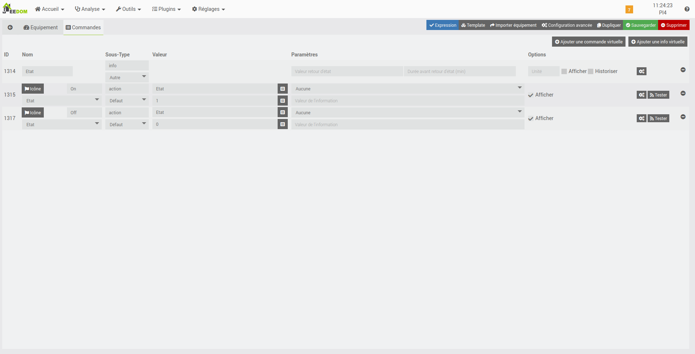

Bonjour à tous ! 
Je voulais partager avec vous la façon dont j'utilise Reolink dans Domoticz. 
 
 
Je ne connaissais pas Reolink auparavant, je cherchais Dlink, Hikvision, Foscam, etc. et j'ai vu le Reolink RLC-420 (pack de 2). 
Pour le prix, elles sont vraiment biens et franchement elles font le job. 
Comme vous pouvez le voir, j'en ai acheté 4. 
 
 
Je cherchais les commandes CGI et n'ai trouvé que ceci: 
How to Capture Live JPEG Image of Reolink Cameras via Web Browsers : <a href="https://support.reolink.com/hc/en-us/articles/360007011233-How-to-Capture-Live-JPEG-Image-of-Reolink-Cameras-via-Web-Browsers" class="postlink">https://support.reolink.com/hc/en-us/ar ... b-Browsers</a> 
 
 
Je vais vous montrer comment utiliser toutes les commandes cgi. 
 
<strong class="text-strong">Introduction</strong> 
<strong class="text-strong">D'abord, vous avez besoin d'un jeton d'authentification (token).</strong>

Code&nbsp;: <a href="#" onclick="selectCode(this); return false;">Tout sélectionner</a>
<pre><code>url = cgi-bin/api.cgi?cmd=Login&amp;token=null
payload = [{"cmd":"Login","action":0,"param":{"User":{"userName":"youruser","password":"yourpassword"}}}]</code></pre>

Lorsque vous avez le jeton, vous pouvez faire ce que vous voulez. 
Exemple:

Code&nbsp;: <a href="#" onclick="selectCode(this); return false;">Tout sélectionner</a>
<pre><code>url = cgi-bin/api.cgi?cmd=SetAlarm&amp;token=azeazeaz65454
payload = [{"cmd":"SetAlarm","action":1,"param":{"Alarm":{"channel":0,"type":"md","sens":[{"beginHour":0,"endHour":23,"beginMin":0,"endMin":59,"id":0,"sensitivity":21},{"beginHour":23,"endHour":23,"beginMin":59,"endMin":59,"id":1,"sensitivity":21},{"beginHour":23,"endHour":23,"beginMin":59,"endMin":59,"id":2,"sensitivity":21},{"beginHour":23,"endHour":23,"beginMin":59,"endMin":59,"id":3,"sensitivity":21}]}}}]</code></pre>

Vous pouvez obtenir l'URL et le payload  avec la console du navigateur pour n'importe quels paramètres/commandes. 
 
 
<strong class="text-strong">Script</strong> 
Script PHP pour activer / désactiver les e-mails et les notifications push: <a href="https://drive.google.com/open?id=1b-2iuqtYMRAOWp-CCSKzk8hOGqW-T4vu" class="postlink">https://drive.google.com/open?id=1b-2iu ... hOGqW-T4vu</a> 
Ce script est fait pour mon usage et codé en 5min. Vous pouvez utiliser d'autres technologies et/ou l'améliorer pour vous. D'abord, je ne voulais que des notifications par courrier électronique et, dans un deuxième temps, j'ai ajouté des notifications push. 
 
 
<strong class="text-strong">Practice</strong> 
Comment j'utilise mon script sur Domoticz. 
 
Mon domoticz est installé sur mon syno, donc mon apache aussi. 
Je peux accéder à mon script par URL: 

Code&nbsp;: <a href="#" onclick="selectCode(this); return false;">Tout sélectionner</a>
<pre><code>Turn on email
http://yoursynologyip:apacheport/?ip=ipofthecamera&amp;method=enableMotionEmail&amp;action=1
Turn off email
http://yoursynologyip:apacheport/?ip=ipofthecamera&amp;method=enableMotionEmail&amp;action=0
</code></pre>

yoursynologyip = l'ip de votre serveur syno ou apache si votre apache n'est pas sur votre syno. 
apacheport = apache port. 
ipofthecamera = ip de la caméra, vous devez associer l'adresse MAC à une adresse IP statique. 
 
 
Créer un switch virtuel on/off et mettre l'URL sur Action on et off 
 
 
Maintenant vous pouvez faire ce que vous voulez. 
Lorsque je quitte ma maison, toutes les notifications des caméras s'activent par GPS ou par scénario. 
Idem quand je rentre à la maison.

 
 
 
 
